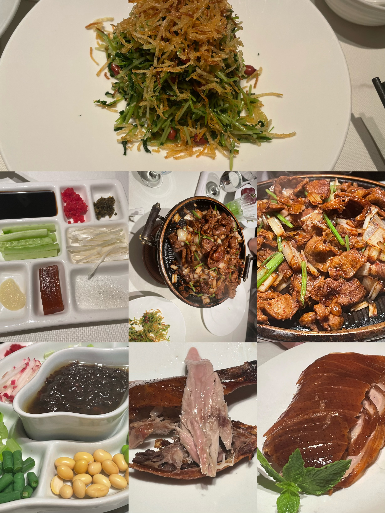
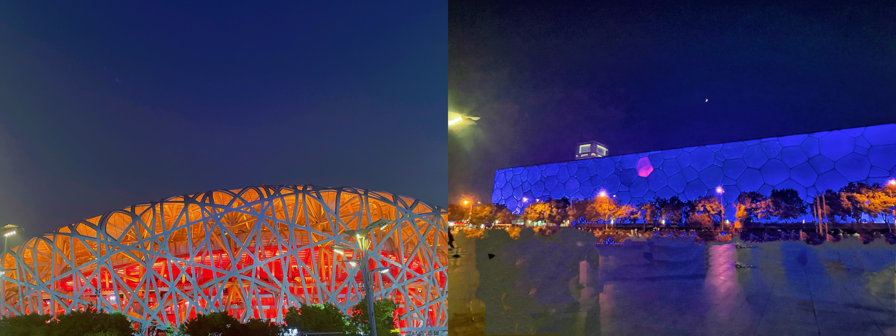
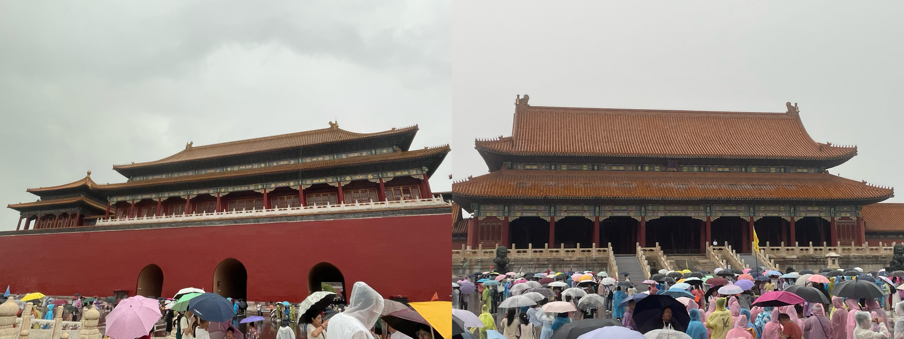
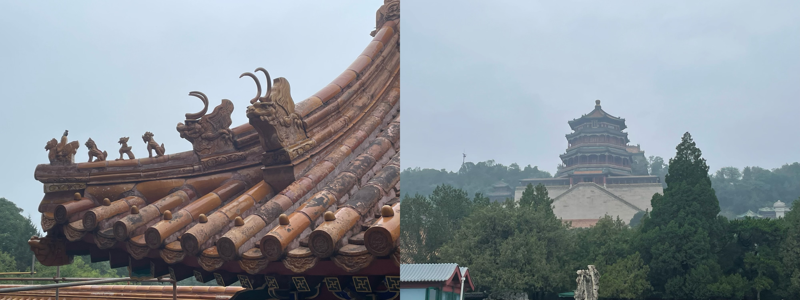
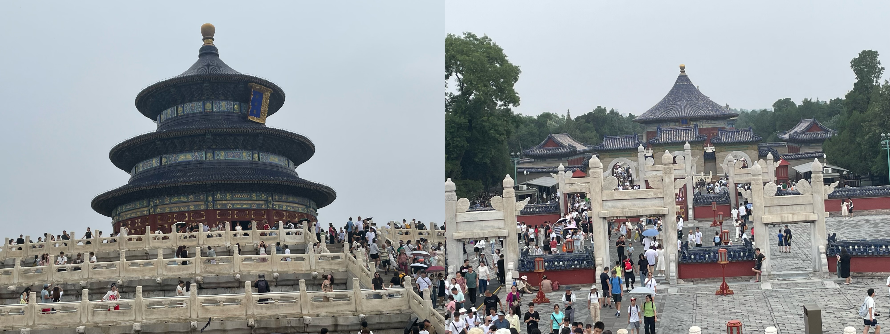
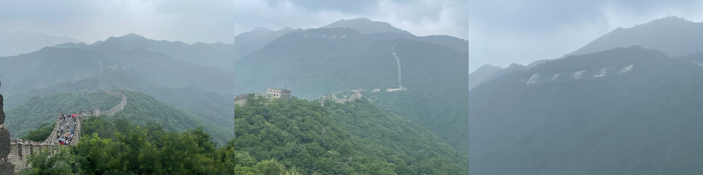
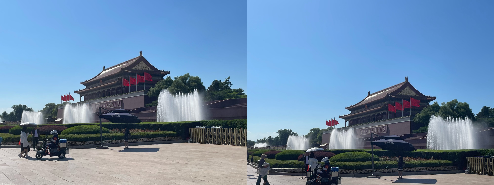

旅行时间：7.11-7.17（7月10号中午到北京，晚上和同学吃饭，16号休息一天）  
	  
 我是在江西长大的，有一说一对北京的美食并不是很提得起兴趣，但是对于北京烤鸭我还是绝对喜欢的。来北京吃烤鸭最有名的几个如四季民福、全聚德等，四季民福比全聚德相对来说便宜（对于我这个来自小城市的人来说人均200左右也不便宜了😅），有名的京菜有紫光园（价格很实惠）  
	  
总的来说玩了一个礼拜，旅游景点顺序为[奥林匹克公园（鸟巢、水立方）->故宫博物馆->颐和园->天坛公园->慕田峪长城->天安门广场]，一天一个景点，主打一个随心所欲😀，不过很多都是提前需要预约的，需要提前规划好路线。  

景点|预约情况|价格|
---|---|---|
奥林匹克公园|不需要预约|免费|
故宫博物馆|需要预约，并且非常难抢，可以从美团、淘宝、咸鱼等方式购买旅游团中的个人票，多花钱|成人票80、学生票60|
颐和园|需要预约，很好约|60元|
天坛公园|需要预约，很好约，买联合票才能去祈年殿和回音壁|成人票34元、学生票17元|
慕田峪长城|需要提前买票，可以买北京旅游集散的车票，直接从前门抵达旅游景点下方|车票+往返缆车票200元|
天安门广场|需要提前预约，如果想要去天安门城楼和毛主席纪念堂需要提前买票，很难抢到票|免费|
## 7.10刚来到酒店
提前订好的酒店，在北京选酒店还是件挺难的事，考虑到交通、两个人住、住的时间长等问题，最后选在在北京四环附近的飘HOME酒店，双床房靠窗，448一晚，已经算比较实惠的了。交通上在14号线将台站附近，去所有景点大概都需要一个小时的通勤时间，只能折中处理了啊😜  
[四季民福]

## 7.11奥林匹克公园（鸟巢、水立方）
为了拍夜景也是等了好久，大概八点多才开始亮灯，不过刚好后面几天是薛之谦在鸟巢开演唱会，晚上在彩排，也是听到最近很火的DJ版好像在哪里见过你（薛之谦彩排的时候可是唱了好几遍的😆）

## 7.12故宫博物馆
刚好遇见北京下大雨的天气，也真奇了怪，北京一年下不了几次雨还让我碰到了，虽然带了伞，但还是在去故宫博物馆的路上鞋子湿透了，不过刚好碰见下雨天气正好瞧见了故宫那强悍的排水系统，不得不佩服古代人在建筑上面的智慧了。可惜是阴雨天气，故宫建筑里面很多是进不去的，光线也不好，不能很好的看到皇帝坐的椅子，也发挥不了皇帝坐在殿堂上与大臣们开会的想象了🤔。不过逛了逛旁边太后们住的地方，感受下慈禧太后的花园，还是挺有历史气息的😋。

## 7.13颐和园
颐和园公园还是挺大的，主要是还有一个昆明湖，转一圈下来很考验我的双腿🦵，坐了小船，爬了小山，感受一下皇帝们的避暑娱乐的场所，还是觉得古代皇帝才是最快乐的🤣。

## 7.14天坛公园
天坛公园有一个很大的特色，很多老人来这休闲娱乐，这里对于60岁以上老人是免费开放的，这也导致一个问题：这个公园我去参观的时候人很多啊🥵。到祈年殿那里人特别的多，根本没有很好的拍照点；回音壁那里如果人不多吼一嗓子是真的有回声的，但是人多了就没有了，难受😭。去天坛就是为了打卡这个高考数学题上出现了几次的地方🤣

## 7.15慕田峪长城（city不city啊）
主要是北京有两处长城的旧址：八达岭长城和慕田峪长城。也是搜集了很多攻略，看了很多评价，主要是刚好去长城是暑假中的星期一，星期一其他旅游景点闭馆，这样导致了长城的游客特别多，尤其是八达岭长城（毕竟八达岭长城比慕田峪长城更有名气），八达岭长城拍照更壮观，慕田峪长城人会更少一点，看旅游所需，由于身边带了个老人出来旅游，只爬了一下段长城（好汉坡啥的都没去），主要是为了打卡“不到长城非好汉”😋

## 7.17天安门广场
天安门广场给人最大的印象就是国家阅兵那浩荡的气势，广场确实很宽广，旁边就是人民大会堂和国家博物馆，前面是人民英雄纪念碑和毛主席纪念堂，再加上武警的站岗给人一种很庄严、严肃的感觉，不愧是国家首都必打卡的地方。

## 最后总结
旅游的时间太久了，最后还是会给人一种疲劳，不过我们一天一个旅游景点，在旅游过程中还是很养精蓄锐的，每次去到这些景点还是活气十足，人生中怎么说都要来一次首都参观，感受中国最大的魅力。